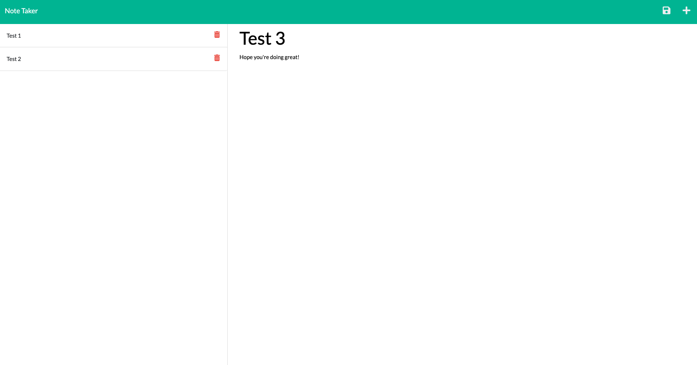

# Note-Taker-Express.js
--- 
## Description 
This application allows the user to input notes in a givin prompt. The application then stores the input into the express servers and stores the input for later use. Then the user is able to delete any notes as they please. 

https://watch.screencastify.com/v/cMkWarhhIYSC8i9i7XHj

--- 

## Getting Started 
You will need to install Express.js as well as Node.js. 

After you will need to 'npm i express" and it should run fine. 

---
## Built With 
Express.js 

Node.js 

JavaScript

---
## Author 
Oscar Silva 

--- 
## Questions 
if you have any question you can contact me at 

GitHub: https://github.com/Ozz760

Email: oscarsilva2356@gmail.com